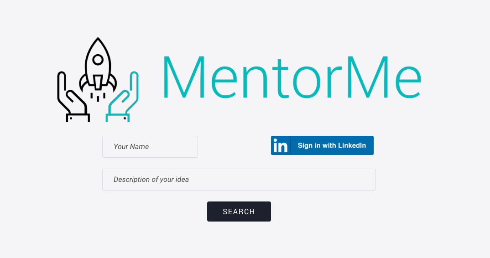

# MentorMe
MentorMe is a mentor recommender system for researchers. You input your name along with a brief description of your startup or research project, and the system will provide to you a list o mentors suggestions for your future startup.

## Usage
### Backend API service
To start the server API you need python installed in your system.
Then type the following commands in the terminal from the *back* folder of this repository:

```
pip3 install -r requirements.txt
python3 app.py
```
Once you have the server running, you can consult the API documentation at the page ``http://localhost:2000/v1.0/ui/``

### Frontend 
To use the frontend, once you have the server running, you just have to open in a browser the file ``index.html`` located in the *web* folder.



### Startup Classifier (Research)
The folder *classifier* contains juppyter notebook files about the startup classifier research done during the program. Consult the report for more information.

# Author

This project was developed by [Andrea Santilli](https://github.com/andry9454) and [Fabrizio Lo Scudo](https://github.com/fablos) during [Pi School's AI programme](http://picampus-school.com/programme/school-of-ai/) in Fall 2019.

